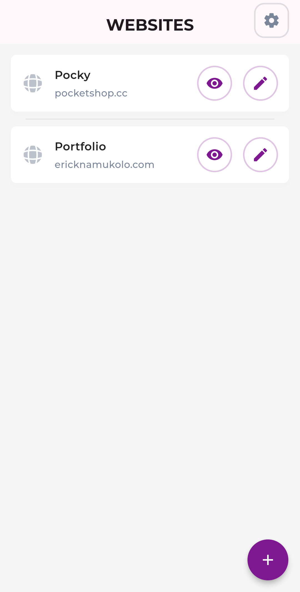
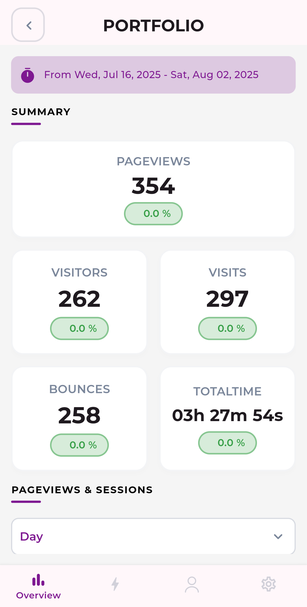
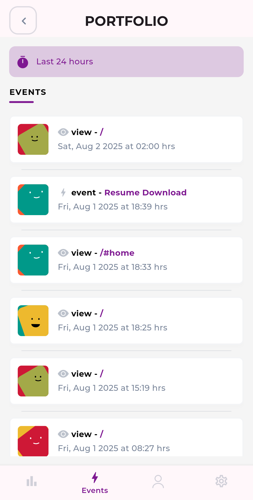
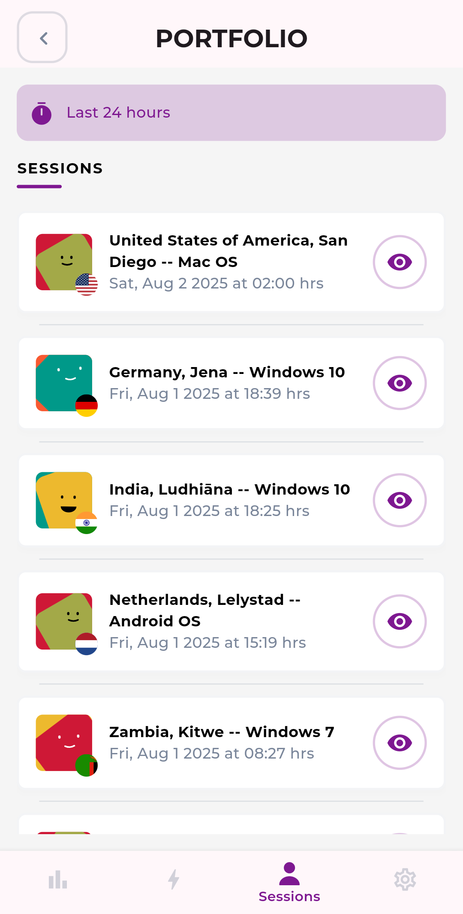
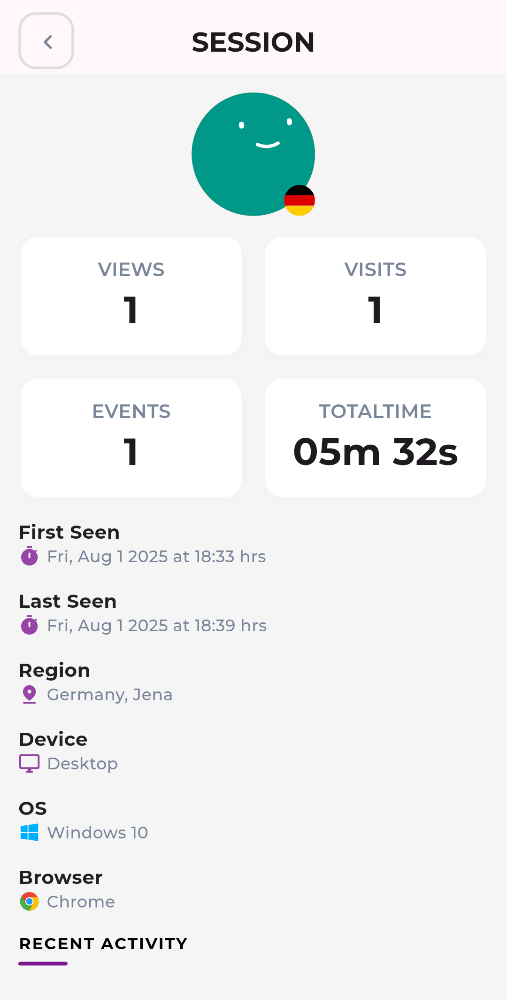

# Pulse for Umami

[](LICENSE)
[](https://flutter.dev/)
[](https://github.com/ericknamukolo/pulse/pulls)

**Pulse for Umami** is a lightweight, unofficial mobile client for [Umami](https://umami.is), the simple, privacy-focused web analytics platform.

This app allows you to securely view your website stats — visitors, pageviews, top pages, referrers, and more — from your phone, wherever you are.

---

## 📸 Screenshots

<div align="center">
  <table>
    <tr>
      <td></td>
      <td></td>
    </tr>
    <tr>
      <td></td>
      <td></td>
    </tr>
    <tr>
      <td></td>
      <td></td>
    </tr>
    <tr>
      <td></td>
      <td></td>
    </tr>
  </table>
</div>

---

## 🚀 Features

- Real-time visitor and pageview stats  
- Traffic breakdown by country, referrer, device, and browser  
- Secure login to your Umami instance  
- Supports both self-hosted and Umami Cloud  
- Clean, minimal, mobile-friendly interface  
- 100% open source and community-driven

---

## 🛠️ Installation

The app is available on the Google Play Store:

[](https://play.google.com/store/apps/details?id=com.sleepingpanda.pulse)

Or build from source:

```bash
git clone https://github.com/ericknamukolo/pulse.git
cd pulse
flutter pub get
flutter run
```

## 🛠️ Contribution

To contribute:

```bash
git checkout -b your-feature-branch
# make changes
git commit -m "Add your feature"
git push origin your-feature-branch
```

## 👋🏽 Maintainer

- Built and maintained by [Erick Namukolo](https://ericknamukolo.com/)
